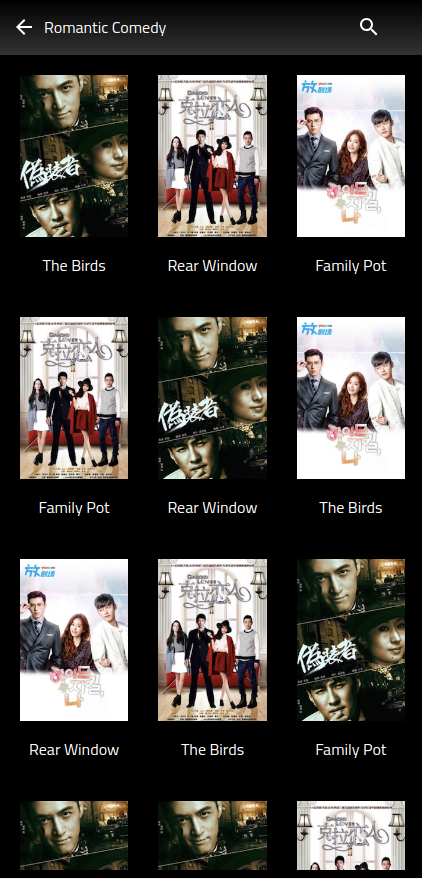
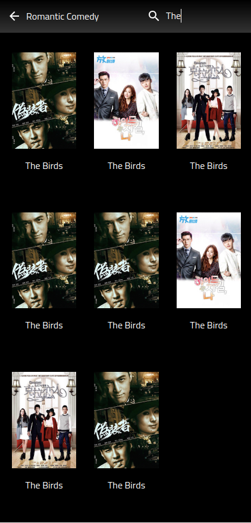

# React + Vite.

1. useContext API
 Efficiently manage and share state across your application with React's useContext API. This approach simplifies state management and reduces prop drilling by providing a way to pass data through the component tree without having to pass props down manually at every level.

2. Hide Scroll Bar
Improve your UI's aesthetics by hiding scroll bars. Although the content remains scrollable, scroll bars will not be visible, providing a cleaner look and better user experience.

3. Lazy Loading
Enhance performance and load times by implementing lazy loading. Components and images are loaded only when they are needed, reducing the initial load time and improving overall application responsiveness.

4. Debouncing
Optimize performance in scenarios involving frequent function calls, such as search inputs. Debouncing limits the rate at which a function can fire, grouping multiple calls into one, and thus reducing unnecessary re-renders or operations.

5. Searching
Implement a responsive and efficient search functionality to help users quickly find relevant information. This feature includes real-time search capabilities with debouncing to ensure smooth and fast user interaction.

6. Back Button 
implement a stable back button functionality that helps users navigate back to the home page while preserving the state of the previous content, Used React Router for routing and state management to retain the previous content. 

7. Error Handling
Maintain application stability and provide a user-friendly experience with robust error handling. This feature includes graceful error messages and error boundaries to catch and manage exceptions effectively.

8. Skeleton View on Image Load
implement a skeleton view for images during page load and while users scroll through the images, integrated both the skeleton loader and lazy loading functionality

